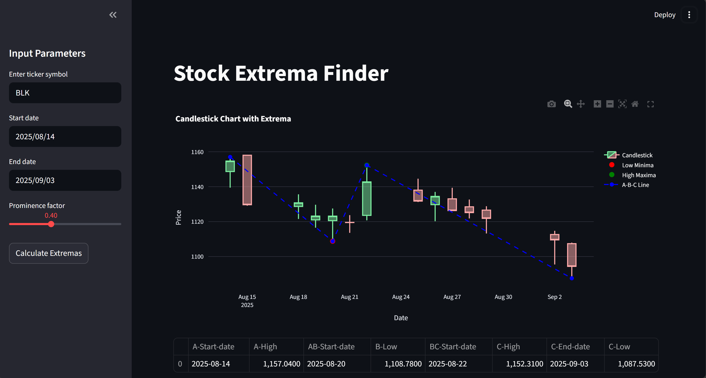

### A simple Streamlit app to visualize stock data with local minima and maxima detection for simple corrections (e.g. 'ABC' -> 'A-B-C' patterns)

Assuming that first maximum and the second minimum are at the start of the pattern, it finds the first minimum and the second maximum.



### Install libraries from pyproject.toml

```python
uv sync
uv run streamlit run app.py
```

or install using `pip` packages from `pyproject.toml`.

### Motivation

It has not been made to find corrections across stocks. The idea is to aid the process of inserting the patterns into your trading platform, once you have already identified them visually. Doing it manually is tedious and error-prone (obviously - this tool is not error-proof either, but if it works: one doesn't need to copy-paste. If not - one just sees the error on the chart).

### Properties

It takes a ticker, start and end date (both inclusive), and a prominence factor (to filter out less significant extrema). Start and end date are not treated as extremas.
Then, it finds a one local minimum on 'lows' chart followed by a one local maximum on 'highs' chart.
